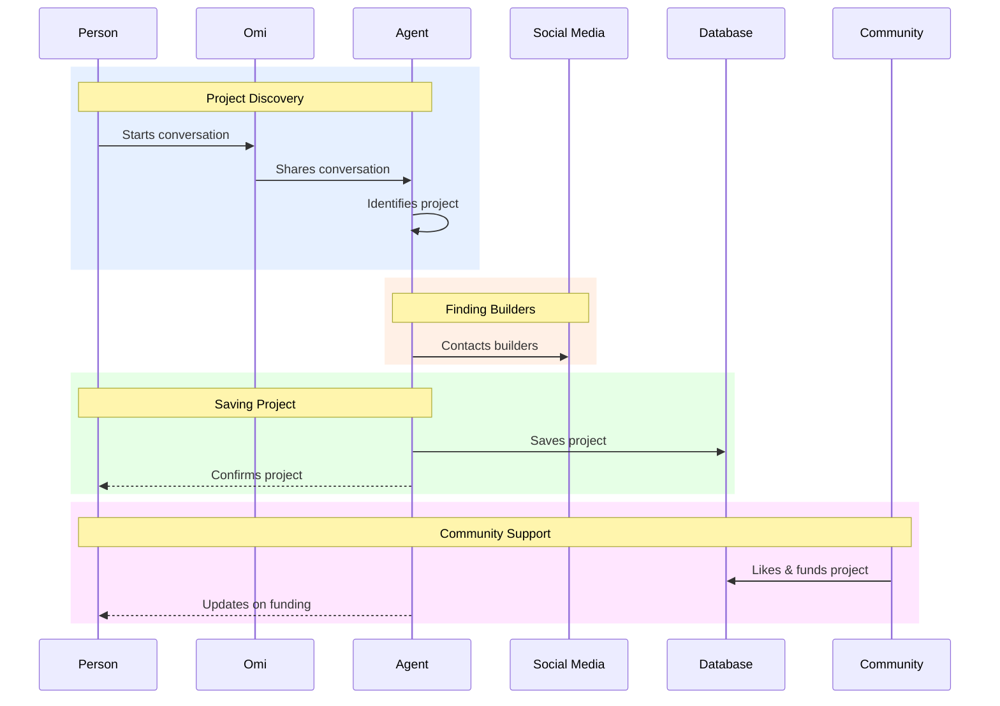

# Brotea Agent Education Platform

## Overview

Brotea is an open-source ecosystem of AI agents for Web3 education and mobile app development. The platform simplifies onboarding and enables component reuse through intelligent guidance and educational tools.

## Vision

We're building an education platform powered by AI agents that helps anyone create mobile components while learning Web3 concepts. Our goal is to democratize access to Web3 and mobile development knowledge through guided, interactive learning experiences.

# For Presentation
###  Action Item Platform - Basic Flow (Easy Version)

## Key Features

### Phase 1: Foundation
- User authentication and profile management
- Basic Web3 educational content
- Simple AI education assistant
- Component repository structure
- Platform UI framework
- Learning progress tracking

### Phase 2: Expansion
- Advanced Web3 educational content
- Enhanced AI education assistant
- Mobile component creation tools
- AI development assistant
- Component search and discovery
- Interactive tutorials
- Community features

### Phase 3: Maturation
- Component testing framework
- Advanced analytics
- Integration with external repositories
- Mobile framework integrations
- Web3 platform integrations
- Collaborative development tools
- Enterprise features

## Project Structure

The project is organized into several key areas:

- **Documentation**: Project planning, architecture, and technical documentation
- **Backend**: API services, database models, and business logic
- **Frontend**: User interface components and client-side logic
- **AI Services**: AI assistant implementations and models
- **Infrastructure**: Deployment configurations and infrastructure as code

## Getting Started

*Coming soon*

## Contributing

We welcome contributions from the community! Please check the issues tab for current tasks and feature requests.

## License

This project is licensed under the MIT License - see the LICENSE file for details.
