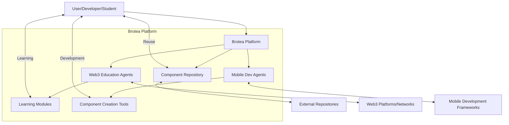

# Brotea: AI Agents for Web3 Education & Mobile Development

## Project Summary
Brotea develops an open-source ecosystem of AI agents that simplify Web3 education and mobile app development by providing intelligent guidance and enabling component reuse. The platform democratizes access to Web3 and mobile development knowledge through AI-powered educational tools that help users create, understand, and reuse mobile components.

## Key Objectives
- Create AI agents specialized in Web3 education that simplify complex concepts for beginners
- Develop AI assistants for mobile app development that guide users through component creation
- Build an open-source ecosystem that promotes component reuse and collaboration
- Reduce the learning curve for Web3 and mobile development technologies
- Enable non-experts to participate in Web3 and mobile app creation through guided experiences

## System Context Diagram

## Risk/Constraints Matrix

| Risk/Constraint | Impact (H/M/L) | Mitigation Strategy |
|-----------------|----------------|---------------------|
| AI agent accuracy and reliability | H | Continuous training with user feedback loops; expert review of educational content |
| Web3 technology evolution | H | Modular architecture to adapt to changing technologies; community contributions |
| Mobile framework compatibility | M | Focus on cross-platform solutions initially; prioritize most popular frameworks |
| User adoption barriers | M | Intuitive UX design; progressive complexity; quick-win templates |
| Educational content quality | H | Expert review process; community validation; iterative improvement |
| Open-source sustainability | M | Build active community; clear contribution guidelines; potential freemium model |
| Integration complexity | M | Well-defined APIs; comprehensive documentation; starter templates |
| Data privacy concerns | H | Transparent data policies; local processing where possible; compliance with regulations |

## Success Metrics

| Metric | Target | Measurement Method |
|--------|--------|-------------------|
| User adoption | 5,000 active users in first year | Platform analytics |
| Component reuse | 40% of projects use existing components | Repository analytics |
| Learning effectiveness | 80% of users report improved understanding | User surveys |
| Time-to-first-component | <2 hours for new users | User journey tracking |
| Community contributions | 100+ community-contributed components in first year | Repository statistics |
| Educational completion | 70% module completion rate | Learning progress tracking |
| User satisfaction | 4.5/5 average rating | In-app feedback |
| Developer productivity | 30% reduction in development time | Before/after comparisons |

## Integration Points

This idea refinement provides:
- A clear foundation for Use Case Generation (Step 2) by identifying key user interactions with the platform
- Context for Prioritization (Step 3) through the risk assessment and success metrics
- Direction for architectural decisions (Step 4) via the system context diagram and technical constraints
