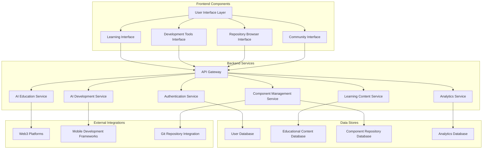
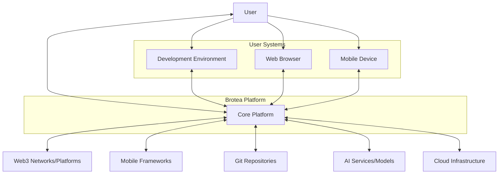

# Brotea: Use Cases and Component Analysis

## Actor Analysis

### Primary Actors
- **Beginner Developer**: Users with minimal Web3/mobile development experience seeking to learn
- **Intermediate Developer**: Users with some experience looking to enhance skills or reuse components
- **Educator**: Users who create or curate educational content for the platform
- **Component Creator**: Users who develop and share reusable components
- **Community Contributor**: Users who improve documentation, provide feedback, or enhance existing components

### Secondary Actors
- **Educational Institution**: Organizations that might adopt the platform for teaching
- **Development Team**: Groups using the platform for collaborative development
- **Open Source Community**: External contributors and users of the shared components

### System Actors
- **Web3 Education Agent**: AI system that provides educational guidance on Web3 concepts
- **Mobile Development Agent**: AI system that assists with mobile component creation
- **Component Repository Manager**: System that catalogs, versions, and manages components
- **Learning Progress Tracker**: System that monitors and reports on user learning progress
- **Integration Service**: System that handles connections with external platforms and frameworks

## Use Case Diagrams

```mermaid
graph TD
    subgraph "Brotea Platform"
        subgraph "Learning Module"
            UC1[UC1: Access Web3 Educational Content]
            UC2[UC2: Complete Interactive Tutorials]
            UC3[UC3: Track Learning Progress]
        end
        
        subgraph "Development Module"
            UC4[UC4: Create Mobile Components]
            UC5[UC5: Get AI Development Assistance]
            UC6[UC6: Test Components]
        end
        
        subgraph "Component Repository"
            UC7[UC7: Search for Components]
            UC8[UC8: Share Created Components]
            UC9[UC9: Fork and Modify Components]
        end
        
        subgraph "Community Module"
            UC10[UC10: Contribute to Documentation]
            UC11[UC11: Provide Feedback on Components]
            UC12[UC12: Participate in Community Discussions]
        end
    end
    
    BeginnerDev[Beginner Developer] --> UC1
    BeginnerDev --> UC2
    BeginnerDev --> UC3
    BeginnerDev --> UC5
    
    IntermediateDev[Intermediate Developer] --> UC4
    IntermediateDev --> UC5
    IntermediateDev --> UC6
    IntermediateDev --> UC7
    IntermediateDev --> UC8
    IntermediateDev --> UC9
    
    Educator[Educator] --> UC1
    Educator --> UC2
    Educator --> UC10
    Educator --> UC12
    
    ComponentCreator[Component Creator] --> UC4
    ComponentCreator --> UC6
    ComponentCreator --> UC8
    ComponentCreator --> UC10
    
    Contributor[Community Contributor] --> UC9
    Contributor --> UC10
    Contributor --> UC11
    Contributor --> UC12
    
    Web3Agent[Web3 Education Agent] --> UC1
    Web3Agent --> UC2
    
    MobileAgent[Mobile Development Agent] --> UC4
    MobileAgent --> UC5
    MobileAgent --> UC6
    
    RepoManager[Component Repository Manager] --> UC7
    RepoManager --> UC8
    RepoManager --> UC9
```

## Use Case Specifications

### UC1: Access Web3 Educational Content
- **Description**: Users access structured educational content about Web3 technologies
- **Actors**: Beginner Developer, Intermediate Developer, Educator, Web3 Education Agent
- **Preconditions**: User is authenticated on the platform
- **Main Flow**:
  1. User navigates to the learning section
  2. User selects a Web3 topic of interest
  3. System presents educational content with AI-enhanced explanations
  4. User consumes content through text, interactive examples, and visualizations
  5. System tracks progress and comprehension
- **Alternative Flows**:
  - User can request simplified explanations if content is too complex
  - User can request advanced details if they want to dive deeper
- **Postconditions**: User's learning progress is updated; system recommends next topics

### UC4: Create Mobile Components
- **Description**: Users create reusable mobile components with AI assistance
- **Actors**: Intermediate Developer, Component Creator, Mobile Development Agent
- **Preconditions**: User is authenticated and has basic development environment setup
- **Main Flow**:
  1. User initiates component creation process
  2. System presents component templates and options
  3. User selects desired functionality and design parameters
  4. Mobile Development Agent provides guidance and suggestions
  5. User iteratively develops the component with AI assistance
  6. System validates component against best practices
- **Alternative Flows**:
  - User can import existing code to enhance
  - User can request AI to generate boilerplate code
- **Postconditions**: New component is created and ready for testing

### UC7: Search for Components
- **Description**: Users search for existing components to reuse in their projects
- **Actors**: Beginner Developer, Intermediate Developer, Component Repository Manager
- **Preconditions**: Component repository is accessible
- **Main Flow**:
  1. User navigates to component repository
  2. User enters search criteria (functionality, platform, etc.)
  3. System returns matching components with ratings and usage metrics
  4. User reviews component details and documentation
  5. User selects component for use in their project
- **Alternative Flows**:
  - User can filter results by various criteria
  - User can compare multiple components side by side
- **Postconditions**: User has selected a component for reuse

## Component Diagram

## Context Diagram

## Component Documentation

### AI Education Service
- **Responsibilities**: 
  - Provide intelligent explanations of Web3 concepts
  - Adapt educational content to user's learning level
  - Generate interactive examples and visualizations
  - Answer user questions about Web3 technologies
- **Interfaces**:
  - REST API for content retrieval and interaction
  - WebSocket for real-time assistance
- **Data Models**:
  - Educational content schema
  - User comprehension model
  - Question-answer pairs
- **Security Considerations**:
  - Content validation to prevent misinformation
  - Rate limiting to prevent abuse
- **Performance Requirements**:
  - Response time < 2 seconds for standard queries
  - Support for concurrent users

### Component Management Service
- **Responsibilities**:
  - Store and retrieve component metadata and code
  - Version control and dependency management
  - Component validation and testing
  - Usage analytics and ratings
- **Interfaces**:
  - REST API for component CRUD operations
  - GraphQL for complex component queries
- **Data Models**:
  - Component metadata schema
  - Version control model
  - Dependency graph
- **Security Considerations**:
  - Code scanning for vulnerabilities
  - Access control for private components
- **Performance Requirements**:
  - Fast search and retrieval (< 1 second)
  - Support for large component repositories

## Technical Constraints

### Technology Stack Requirements
- **Frontend**:
  - Modern JavaScript framework (React/Vue/Angular)
  - Mobile-responsive design
  - WebAssembly support for interactive examples
- **Backend**:
  - Scalable microservices architecture
  - Support for real-time communication
  - AI/ML integration capabilities
- **Data Storage**:
  - Relational database for user and structured data
  - Document database for educational content
  - Object storage for component code and assets

### Infrastructure Needs
- **Compute**:
  - Scalable cloud infrastructure
  - GPU support for AI model inference
  - Edge computing for low-latency interactions
- **Networking**:
  - Global CDN for content delivery
  - WebSocket support for real-time features
  - API gateway with rate limiting and caching

### Integration Requirements
- **Web3 Platforms**:
  - APIs for major blockchain networks
  - Smart contract interaction capabilities
  - Wallet integration support
- **Mobile Frameworks**:
  - Integration with React Native, Flutter, etc.
  - Native module bridging capabilities
  - Testing frameworks for mobile components

### Security Protocols
- **Authentication**:
  - OAuth 2.0 / OpenID Connect
  - Multi-factor authentication option
  - JWT for API authorization
- **Data Protection**:
  - End-to-end encryption for sensitive data
  - GDPR and CCPA compliance
  - Regular security audits and penetration testing
