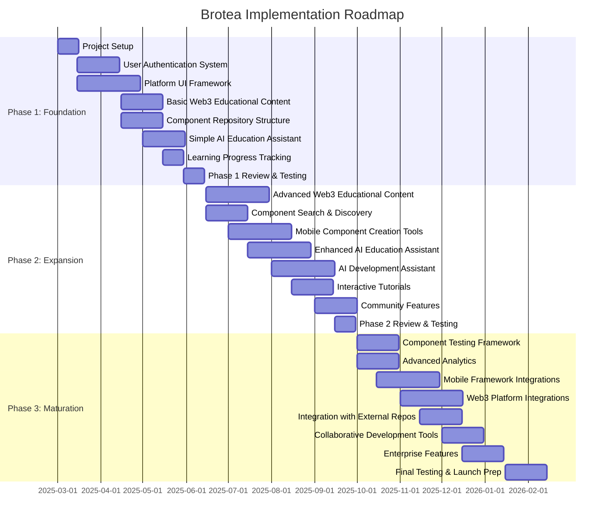
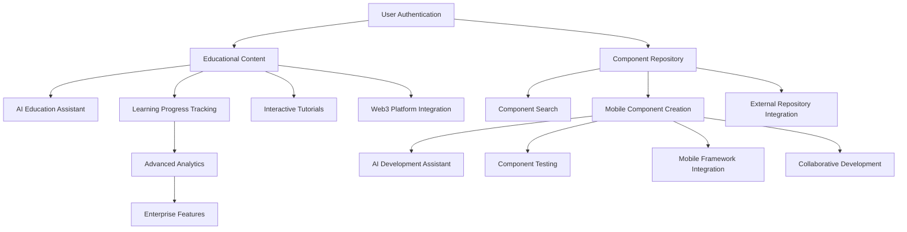

# Brotea: Prioritization and Estimation

## Executive Summary

This document outlines the prioritization strategy and estimation for the Brotea platform development. The approach focuses on delivering core value quickly while managing technical complexity and risks. The implementation is structured into three phases over a 12-month timeline, with clear milestones and dependencies.

## Prioritized Backlog

### Phase 1: Foundation (Months 1-3)

| Feature | Priority | Business Value | Technical Complexity | Risk | Dependencies |
|---------|:--------:|:--------------:|:--------------------:|:----:|--------------|
| User Authentication System | 5 | 4 | 3 | 2 | None |
| Basic Web3 Educational Content | 5 | 5 | 2 | 1 | User Authentication |
| Simple AI Education Assistant | 5 | 5 | 4 | 3 | Educational Content |
| Component Repository Structure | 5 | 4 | 3 | 2 | User Authentication |
| Platform UI Framework | 4 | 3 | 3 | 2 | None |
| Learning Progress Tracking | 3 | 4 | 2 | 1 | User Authentication, Educational Content |

**Phase 1 Rationale**: These features establish the core platform infrastructure and provide immediate value to early users. The authentication system and basic educational content are prioritized to enable user onboarding, while the simple AI assistant demonstrates the platform's unique value proposition. The component repository structure lays groundwork for later phases.

### Phase 2: Expansion (Months 4-8)

| Feature | Priority | Business Value | Technical Complexity | Risk | Dependencies |
|---------|:--------:|:--------------:|:--------------------:|:----:|--------------|
| Advanced Web3 Educational Content | 4 | 5 | 3 | 2 | Basic Educational Content |
| Enhanced AI Education Assistant | 4 | 5 | 5 | 4 | Simple AI Assistant |
| Mobile Component Creation Tools | 4 | 5 | 4 | 3 | Component Repository |
| AI Development Assistant | 4 | 5 | 5 | 4 | Component Repository |
| Component Search & Discovery | 4 | 4 | 3 | 2 | Component Repository |
| Interactive Tutorials | 3 | 4 | 4 | 3 | Basic Educational Content |
| Community Features | 3 | 3 | 2 | 2 | User Authentication |

**Phase 2 Rationale**: This phase enhances the core functionality with more advanced features. The educational content and AI assistants are upgraded to provide deeper value, while the component creation tools enable the platform's mobile development capabilities. Search and community features improve usability and engagement.

### Phase 3: Maturation (Months 9-12)

| Feature | Priority | Business Value | Technical Complexity | Risk | Dependencies |
|---------|:--------:|:--------------:|:--------------------:|:----:|--------------|
| Component Testing Framework | 3 | 4 | 4 | 3 | Component Creation Tools |
| Advanced Analytics | 3 | 4 | 3 | 2 | Learning Progress Tracking |
| Integration with External Repositories | 3 | 4 | 4 | 4 | Component Repository |
| Mobile Framework Integrations | 3 | 4 | 5 | 4 | Component Creation Tools |
| Web3 Platform Integrations | 3 | 4 | 5 | 4 | Advanced Educational Content |
| Collaborative Development Tools | 2 | 3 | 4 | 3 | Component Creation Tools |
| Enterprise Features | 2 | 4 | 3 | 3 | Advanced Analytics |

**Phase 3 Rationale**: The final phase focuses on integration, quality, and enterprise readiness. Testing frameworks ensure component reliability, while integrations with external systems expand the platform's reach. Analytics and enterprise features prepare the platform for organizational adoption.

## Implementation Roadmap

### Key Milestones

1. **MVP Launch** (End of Phase 1)
   - Basic educational platform with simple AI assistance
   - Initial component repository structure
   - Core user authentication and tracking

2. **Beta Release** (End of Phase 2)
   - Full educational content for Web3
   - Mobile component creation capabilities
   - Enhanced AI assistants for education and development
   - Community features and interactive tutorials

3. **Full Platform Launch** (End of Phase 3)
   - Complete integration ecosystem
   - Enterprise-ready features
   - Advanced analytics and testing frameworks
   - Collaborative development environment

### Dependencies Graph

## Resource Planning

### Team Composition

| Role | Phase 1 | Phase 2 | Phase 3 | Skills Required |
|------|:-------:|:-------:|:-------:|-----------------|
| Frontend Developer | 2 | 3 | 3 | React/Vue, Mobile UI, WebAssembly |
| Backend Developer | 2 | 3 | 3 | Node.js, Microservices, API Design |
| AI/ML Engineer | 1 | 2 | 2 | NLP, ML Models, AI Integration |
| Web3 Developer | 1 | 1 | 2 | Blockchain, Smart Contracts, Web3 APIs |
| DevOps Engineer | 1 | 1 | 1 | CI/CD, Cloud Infrastructure, Monitoring |
| UX/UI Designer | 1 | 1 | 1 | Educational UX, Developer Tools Design |
| Technical Writer | 0.5 | 1 | 1 | Documentation, Tutorials |
| QA Engineer | 1 | 1 | 2 | Automated Testing, Quality Assurance |
| Project Manager | 1 | 1 | 1 | Agile, Technical Project Management |

### Infrastructure Requirements

| Resource | Phase 1 | Phase 2 | Phase 3 | Notes |
|----------|:-------:|:-------:|:-------:|-------|
| Cloud Compute | Medium | High | High | Scalable instances for microservices |
| Database Storage | Low | Medium | High | Mix of relational and document DBs |
| AI Model Hosting | Medium | High | High | GPU instances for AI assistants |
| CDN | Low | Medium | High | Global content delivery |
| CI/CD Pipeline | Basic | Advanced | Advanced | Automated testing and deployment |
| Monitoring Tools | Basic | Advanced | Advanced | Performance and error tracking |
| Development Environments | Basic | Advanced | Advanced | Local and cloud development |

## Estimation Matrix

### Development Effort (in Story Points)

| Feature Area | Phase 1 | Phase 2 | Phase 3 | Total |
|--------------|:-------:|:-------:|:-------:|:-----:|
| User & Auth System | 40 | 20 | 20 | 80 |
| Educational Content | 50 | 70 | 30 | 150 |
| AI Assistants | 60 | 100 | 40 | 200 |
| Component Repository | 50 | 60 | 70 | 180 |
| UI/UX | 40 | 50 | 30 | 120 |
| Analytics & Tracking | 20 | 30 | 50 | 100 |
| Integrations | 0 | 40 | 80 | 120 |
| Community Features | 0 | 40 | 30 | 70 |
| Testing Framework | 20 | 30 | 50 | 100 |
| **Total** | **280** | **440** | **400** | **1120** |

### Time Estimates (in Person-Months)

| Feature Area | Phase 1 | Phase 2 | Phase 3 | Total |
|--------------|:-------:|:-------:|:-------:|:-----:|
| User & Auth System | 2.0 | 1.0 | 1.0 | 4.0 |
| Educational Content | 2.5 | 3.5 | 1.5 | 7.5 |
| AI Assistants | 3.0 | 5.0 | 2.0 | 10.0 |
| Component Repository | 2.5 | 3.0 | 3.5 | 9.0 |
| UI/UX | 2.0 | 2.5 | 1.5 | 6.0 |
| Analytics & Tracking | 1.0 | 1.5 | 2.5 | 5.0 |
| Integrations | 0.0 | 2.0 | 4.0 | 6.0 |
| Community Features | 0.0 | 2.0 | 1.5 | 3.5 |
| Testing Framework | 1.0 | 1.5 | 2.5 | 5.0 |
| **Total** | **14.0** | **22.0** | **20.0** | **56.0** |

### Cost Implications

| Category | Phase 1 | Phase 2 | Phase 3 | Total |
|----------|:-------:|:-------:|:-------:|:-----:|
| Personnel | $$$$ | $$$$$ | $$$$$ | $$$$$$ |
| Infrastructure | $$ | $$$ | $$$$ | $$$$$ |
| Third-party Services | $$ | $$$ | $$$ | $$$$ |
| Tools & Licenses | $$ | $$ | $$ | $$$ |
| Contingency (15%) | $$ | $$$ | $$$ | $$$$ |
| **Total** | **$$$$$** | **$$$$$$$** | **$$$$$$$** | **$$$$$$$$$** |

## Risk Mitigation Plan

| Risk | Probability | Impact | Mitigation Strategy |
|------|:----------:|:------:|---------------------|
| AI assistant accuracy issues | High | High | Start with narrow scope; implement feedback loops; human review of outputs |
| Web3 technology changes | High | Medium | Modular architecture; focus on fundamentals; adaptable content structure |
| Mobile framework compatibility | Medium | High | Start with most popular frameworks; abstract common patterns; thorough testing |
| Resource constraints | Medium | High | Phased approach; prioritize core features; leverage open source |
| User adoption challenges | Medium | High | Early user testing; focus on UX; clear value proposition |
| Integration complexity | Medium | Medium | Well-defined APIs; thorough documentation; incremental approach |
| Security vulnerabilities | Medium | High | Regular security audits; follow best practices; penetration testing |
| Performance issues | Medium | Medium | Performance testing; scalable architecture; optimization sprints |
| Content quality concerns | Medium | High | Expert review process; user feedback; iterative improvement |

## Assumptions and Constraints

### Assumptions
- Team has access to necessary Web3 and mobile development expertise
- AI models can be effectively trained for educational and development assistance
- Open-source community will engage with the platform
- Target users have basic development knowledge

### Constraints
- Initial development with limited resources
- Need to balance educational depth with technical complexity
- Mobile framework landscape continues to evolve
- Web3 technologies are still maturing

## Next Steps

1. **Immediate Actions**:
   - Finalize team composition for Phase 1
   - Set up development infrastructure
   - Create detailed specifications for authentication and UI framework
   - Begin development of core educational content

2. **Key Decisions Required**:
   - Selection of specific Web3 technologies to support initially
   - Choice of mobile frameworks to prioritize
   - AI model selection and training approach
   - Open-source licensing strategy

3. **Preparation for Phase 1**:
   - Develop sprint plans for first 3 months
   - Establish development standards and processes
   - Set up monitoring and quality metrics
   - Create user testing plan
