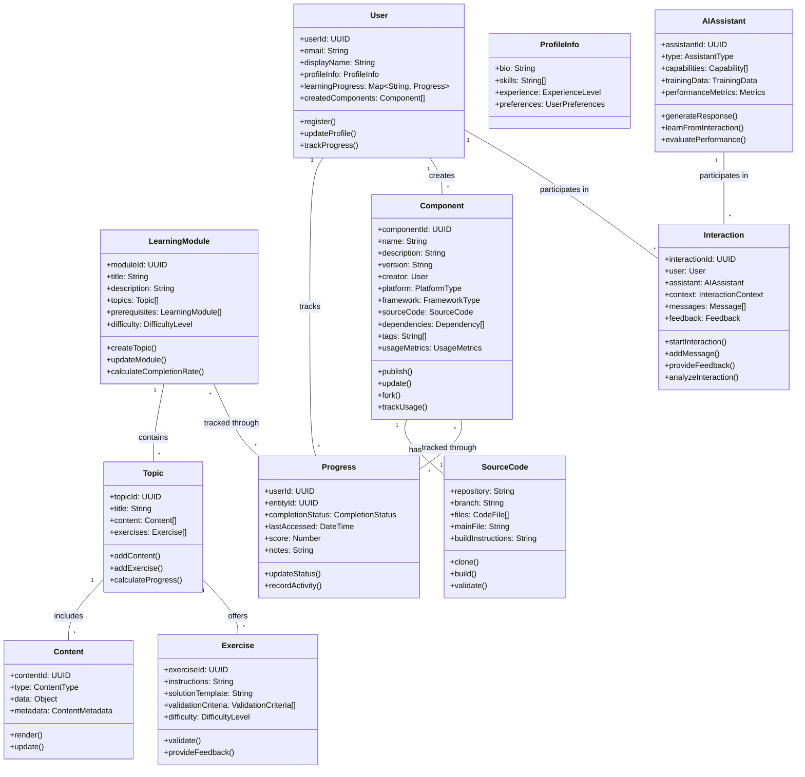
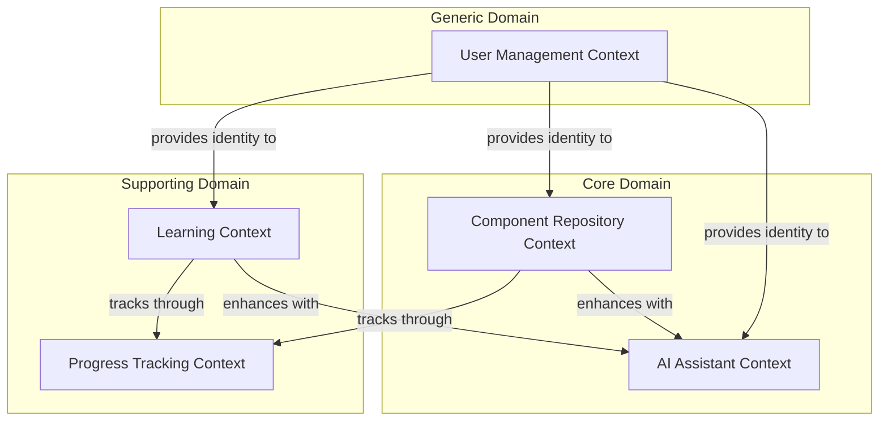
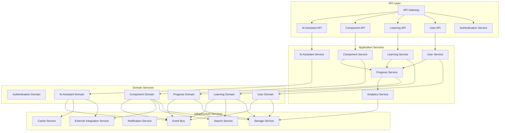
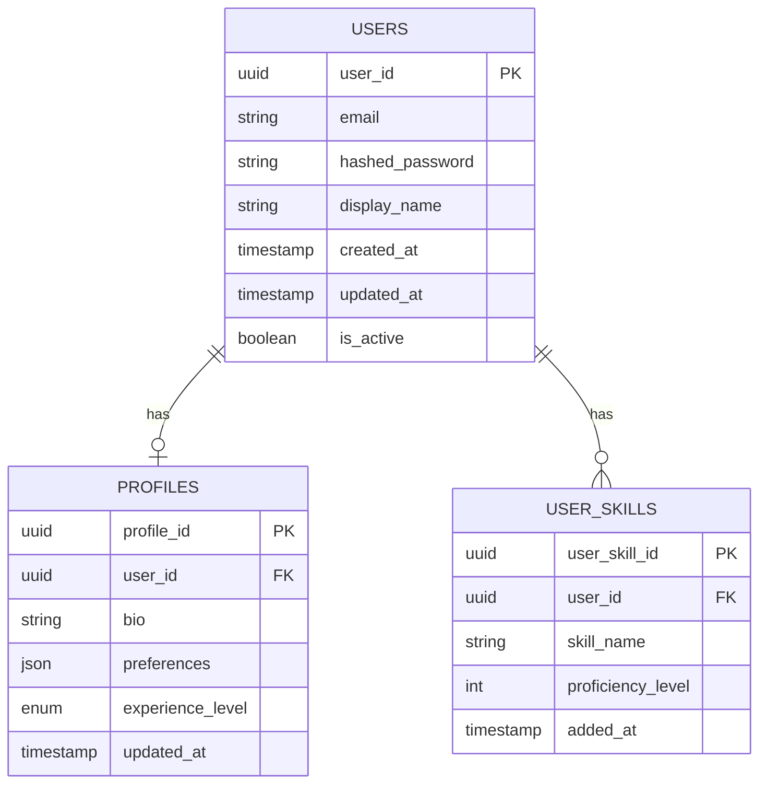
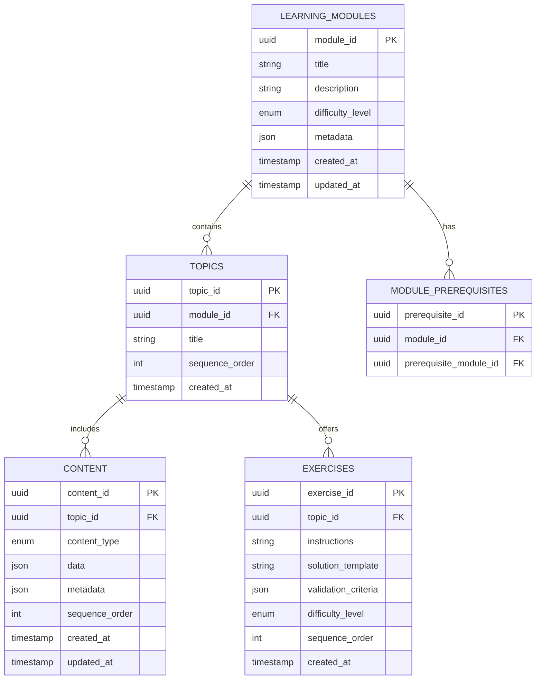
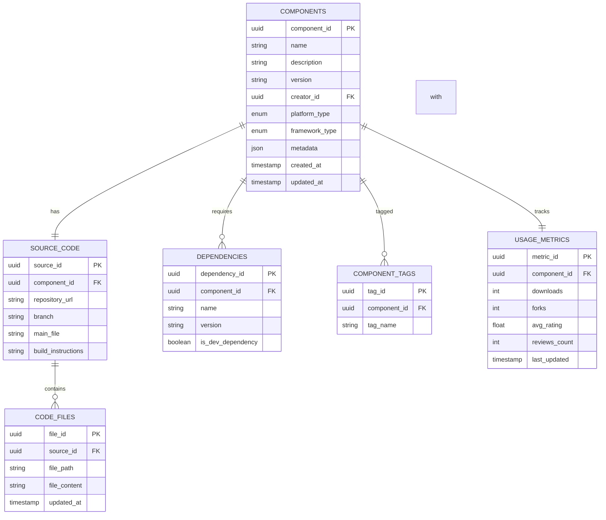
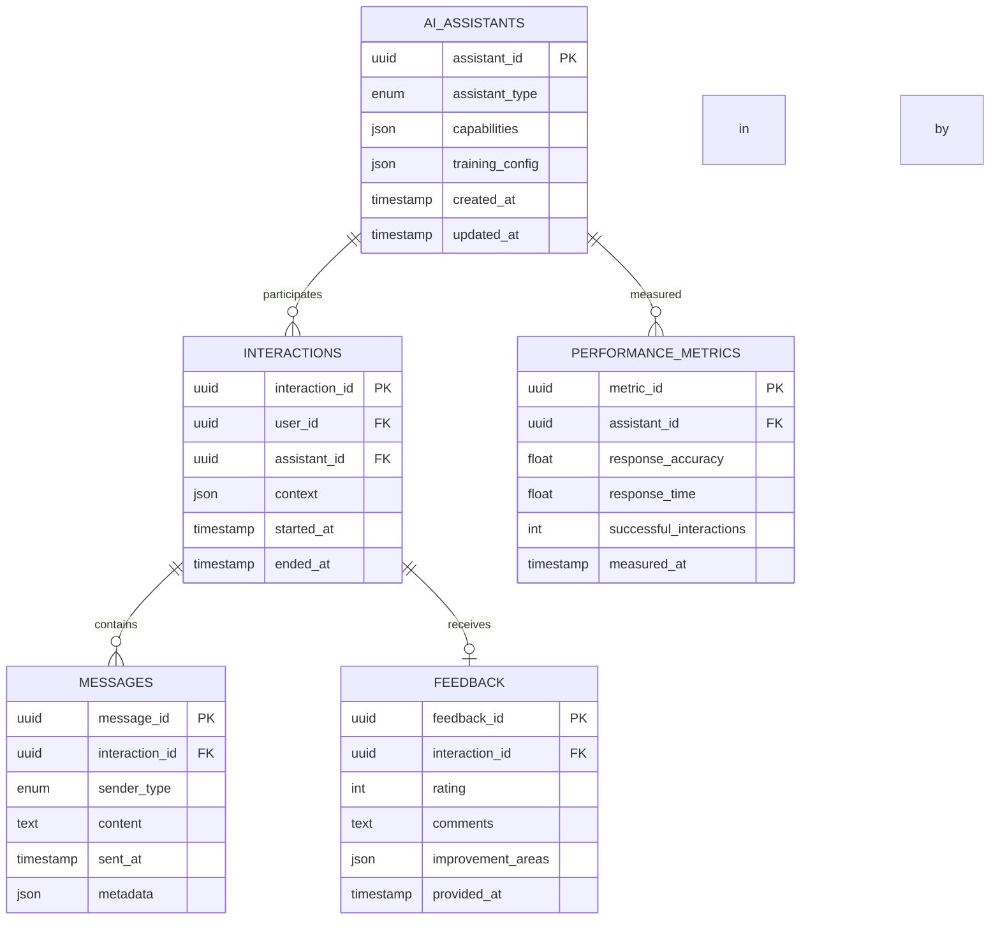

# Brotea: Model and Service Definition

## Domain Model Overview

The Brotea platform is designed around several key bounded contexts that reflect the core capabilities of the system. This document outlines the domain models, service architecture, and implementation guidelines following Domain-Driven Design principles and SOLID patterns.

## Domain Model Diagram



## Bounded Contexts

### 1. User Management Context
**Core Entities**: User, ProfileInfo, Authentication
**Value Objects**: UserPreferences, ExperienceLevel
**Aggregates**: User (root)
**Domain Events**: UserRegistered, ProfileUpdated, SkillsUpdated

### 2. Learning Context
**Core Entities**: LearningModule, Topic, Content, Exercise
**Value Objects**: DifficultyLevel, ContentMetadata, ValidationCriteria
**Aggregates**: LearningModule (root), Topic
**Domain Events**: ModuleCompleted, ExerciseSubmitted, ContentViewed

### 3. Progress Tracking Context
**Core Entities**: Progress
**Value Objects**: CompletionStatus, Score
**Aggregates**: Progress (root)
**Domain Events**: ProgressUpdated, AchievementUnlocked, MilestoneReached

### 4. Component Repository Context
**Core Entities**: Component, SourceCode, Dependency
**Value Objects**: Version, PlatformType, FrameworkType, UsageMetrics
**Aggregates**: Component (root)
**Domain Events**: ComponentPublished, ComponentForked, ComponentUpdated

### 5. AI Assistant Context
**Core Entities**: AIAssistant, Interaction, Message
**Value Objects**: AssistantType, Capability, InteractionContext, Feedback
**Aggregates**: AIAssistant (root), Interaction
**Domain Events**: InteractionStarted, ResponseGenerated, FeedbackProvided

## Context Map



## Service Architecture

### Application Services



## Data Model

### User Management Schema



### Learning Context Schema



### Progress Tracking Schema

```mermaid
erDiagram
    USER_PROGRESS {
        uuid progress_id PK
        uuid user_id FK
        uuid entity_id
        string entity_type
        enum completion_status
        int score
        timestamp last_accessed
        string notes
    }
    
    ACHIEVEMENTS {
        uuid achievement_id PK
        string name
        string description
        string criteria
        string badge_image
    }
    
    USER_ACHIEVEMENTS {
        uuid user_achievement_id PK
        uuid user_id FK
        uuid achievement_id FK
        timestamp earned_at
    }
    
    USER_PROGRESS ||--o{ USER_ACHIEVEMENTS : leads to
    ACHIEVEMENTS ||--o{ USER_ACHIEVEMENTS : earned as
```

### Component Repository Schema



### AI Assistant Schema



## Service Interfaces

### User Service Interface

```typescript
interface UserService {
  // User management
  registerUser(email: string, password: string, displayName: string): Promise<User>;
  authenticateUser(email: string, password: string): Promise<AuthToken>;
  getUserProfile(userId: string): Promise<UserProfile>;
  updateUserProfile(userId: string, profileData: Partial<UserProfile>): Promise<UserProfile>;
  
  // Skills management
  addUserSkill(userId: string, skill: Skill): Promise<void>;
  removeUserSkill(userId: string, skillId: string): Promise<void>;
  getUserSkills(userId: string): Promise<Skill[]>;
  
  // User preferences
  getUserPreferences(userId: string): Promise<UserPreferences>;
  updateUserPreferences(userId: string, preferences: Partial<UserPreferences>): Promise<UserPreferences>;
}
```

### Learning Service Interface

```typescript
interface LearningService {
  // Module management
  getModules(filters?: ModuleFilters): Promise<LearningModule[]>;
  getModuleById(moduleId: string): Promise<LearningModule>;
  createModule(moduleData: ModuleCreationData): Promise<LearningModule>;
  updateModule(moduleId: string, moduleData: Partial<ModuleUpdateData>): Promise<LearningModule>;
  
  // Topic management
  getTopicsByModuleId(moduleId: string): Promise<Topic[]>;
  getTopicById(topicId: string): Promise<Topic>;
  createTopic(moduleId: string, topicData: TopicCreationData): Promise<Topic>;
  updateTopic(topicId: string, topicData: Partial<TopicUpdateData>): Promise<Topic>;
  
  // Content management
  getContentByTopicId(topicId: string): Promise<Content[]>;
  createContent(topicId: string, contentData: ContentCreationData): Promise<Content>;
  updateContent(contentId: string, contentData: Partial<ContentUpdateData>): Promise<Content>;
  
  // Exercise management
  getExercisesByTopicId(topicId: string): Promise<Exercise[]>;
  createExercise(topicId: string, exerciseData: ExerciseCreationData): Promise<Exercise>;
  updateExercise(exerciseId: string, exerciseData: Partial<ExerciseUpdateData>): Promise<Exercise>;
  validateExerciseSolution(exerciseId: string, solution: string): Promise<ValidationResult>;
}
```

### Component Service Interface

```typescript
interface ComponentService {
  // Component management
  getComponents(filters?: ComponentFilters): Promise<Component[]>;
  getComponentById(componentId: string): Promise<Component>;
  createComponent(componentData: ComponentCreationData): Promise<Component>;
  updateComponent(componentId: string, componentData: Partial<ComponentUpdateData>): Promise<Component>;
  
  // Source code management
  getSourceCode(componentId: string): Promise<SourceCode>;
  updateSourceCode(componentId: string, sourceData: Partial<SourceCodeUpdateData>): Promise<SourceCode>;
  
  // Component operations
  forkComponent(componentId: string, userId: string): Promise<Component>;
  publishComponent(componentId: string): Promise<PublishResult>;
  validateComponent(componentId: string): Promise<ValidationResult>;
  
  // Component metrics
  getComponentMetrics(componentId: string): Promise<UsageMetrics>;
  rateComponent(componentId: string, userId: string, rating: number, review?: string): Promise<void>;
  
  // Search and discovery
  searchComponents(query: string, filters?: ComponentFilters): Promise<SearchResults<Component>>;
  getRecommendedComponents(userId: string): Promise<Component[]>;
}
```

### AI Assistant Service Interface

```typescript
interface AIAssistantService {
  // Assistant management
  getAssistants(type?: AssistantType): Promise<AIAssistant[]>;
  getAssistantById(assistantId: string): Promise<AIAssistant>;
  
  // Interaction management
  startInteraction(userId: string, assistantId: string, context?: InteractionContext): Promise<Interaction>;
  sendMessage(interactionId: string, content: string, metadata?: any): Promise<Message>;
  getInteractionHistory(interactionId: string): Promise<Message[]>;
  endInteraction(interactionId: string): Promise<void>;
  
  // Feedback management
  provideFeedback(interactionId: string, feedback: Feedback): Promise<void>;
  getAssistantPerformance(assistantId: string): Promise<PerformanceMetrics>;
  
  // Educational assistance
  explainConcept(concept: string, userLevel: ExperienceLevel): Promise<Explanation>;
  generateExample(concept: string, context?: string): Promise<Example>;
  
  // Development assistance
  suggestImplementation(requirements: string, platform: PlatformType, framework?: FrameworkType): Promise<Implementation>;
  reviewCode(code: string, criteria?: ReviewCriteria): Promise<CodeReview>;
  debugIssue(code: string, errorDescription: string): Promise<DebugSolution>;
}
```

### Progress Service Interface

```typescript
interface ProgressService {
  // Progress tracking
  getUserProgress(userId: string, entityType?: string): Promise<Progress[]>;
  getEntityProgress(entityId: string, entityType: string): Promise<Progress[]>;
  updateProgress(userId: string, entityId: string, entityType: string, status: CompletionStatus, score?: number): Promise<Progress>;
  
  // Achievement management
  getUserAchievements(userId: string): Promise<Achievement[]>;
  checkAchievements(userId: string): Promise<Achievement[]>;
  
  // Analytics
  getUserLearningStats(userId: string): Promise<LearningStats>;
  getModuleCompletionStats(moduleId: string): Promise<CompletionStats>;
  getComponentUsageStats(componentId: string): Promise<UsageStats>;
}
```

## Implementation Guidelines

### Coding Standards

1. **Naming Conventions**
   - Use descriptive, domain-specific names for classes, methods, and variables
   - Follow language-specific conventions (camelCase for JavaScript/TypeScript, snake_case for database)
   - Prefix interfaces with 'I' in languages that support it

2. **Code Organization**
   - Organize code by bounded context, then by layer
   - Keep domain logic separate from infrastructure concerns
   - Use feature folders for related functionality

3. **Documentation**
   - Document all public APIs with JSDoc or similar
   - Include purpose, parameters, return values, and exceptions
   - Document domain concepts in a central glossary

### Pattern Usage

1. **Repository Pattern**
   - Use repositories to abstract data access
   - Implement repository interfaces for each aggregate
   - Keep query logic in repositories, not in domain entities

2. **Factory Pattern**
   - Use factories to create complex domain objects
   - Ensure all invariants are satisfied during creation
   - Implement static factory methods for common creation scenarios

3. **Strategy Pattern**
   - Use for varying algorithms (e.g., validation strategies, recommendation algorithms)
   - Implement strategy interfaces for each variation
   - Allow runtime strategy selection where appropriate

4. **Observer Pattern**
   - Use for domain events and notifications
   - Implement via event bus for loose coupling
   - Ensure proper error handling in observers

### Error Handling

1. **Domain Exceptions**
   - Create specific exception types for domain rule violations
   - Include contextual information in exceptions
   - Document expected exceptions in method contracts

2. **Validation**
   - Validate inputs at system boundaries
   - Use domain validation for business rules
   - Return comprehensive validation results

3. **Error Responses**
   - Use consistent error response format across APIs
   - Include error codes, messages, and troubleshooting info
   - Log detailed error information for debugging

### Logging Requirements

1. **Log Levels**
   - ERROR: Unexpected errors that require attention
   - WARN: Potential issues that don't prevent operation
   - INFO: Significant system events
   - DEBUG: Detailed information for troubleshooting

2. **Log Content**
   - Include timestamp, context, and correlation ID
   - Log structured data where possible
   - Avoid logging sensitive information

3. **Monitoring Integration**
   - Integrate logs with monitoring system
   - Set up alerts for critical errors
   - Implement health checks for all services

### Performance Criteria

1. **Response Times**
   - API endpoints: < 200ms for 95% of requests
   - AI responses: < 2s for simple queries, < 5s for complex
   - Search operations: < 500ms for typical queries

2. **Throughput**
   - Support 100+ concurrent users initially
   - Scale to 1000+ concurrent users in production
   - Handle 100+ requests per second per service

3. **Resource Usage**
   - Optimize memory usage for AI models
   - Implement efficient caching strategies
   - Monitor and optimize database query performance

## Validation Checklist

### Domain Correctness
- [ ] All business entities and relationships are accurately modeled
- [ ] Business rules are explicitly captured in the domain model
- [ ] Ubiquitous language is consistent across all documentation
- [ ] Bounded contexts are properly identified and separated

### Technical Feasibility
- [ ] Architecture supports the required scalability
- [ ] Performance goals are achievable with the chosen design
- [ ] Security requirements can be met with the proposed approach
- [ ] Integration points are clearly defined and manageable

### Implementation Clarity
- [ ] Responsibilities are clearly assigned to specific components
- [ ] Interfaces are well-defined and cohesive
- [ ] Dependencies are managed according to SOLID principles
- [ ] Error handling and logging strategies are comprehensive
