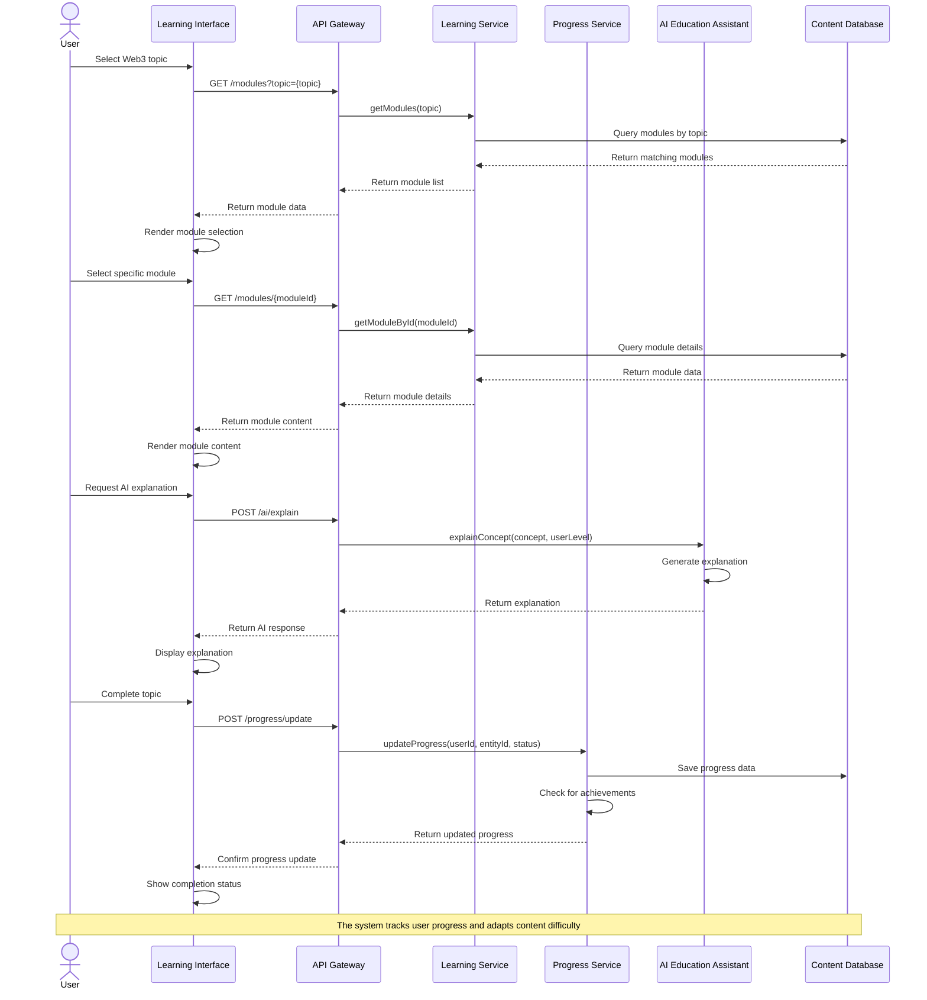
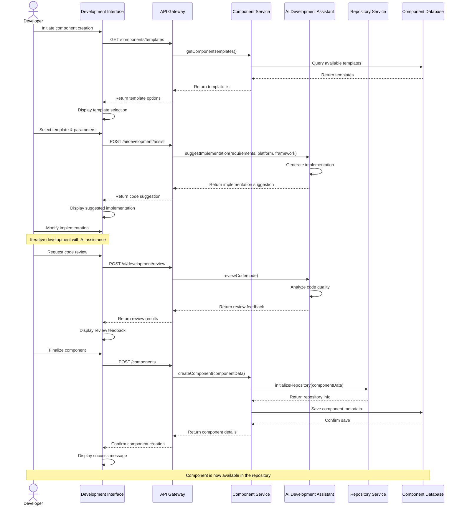
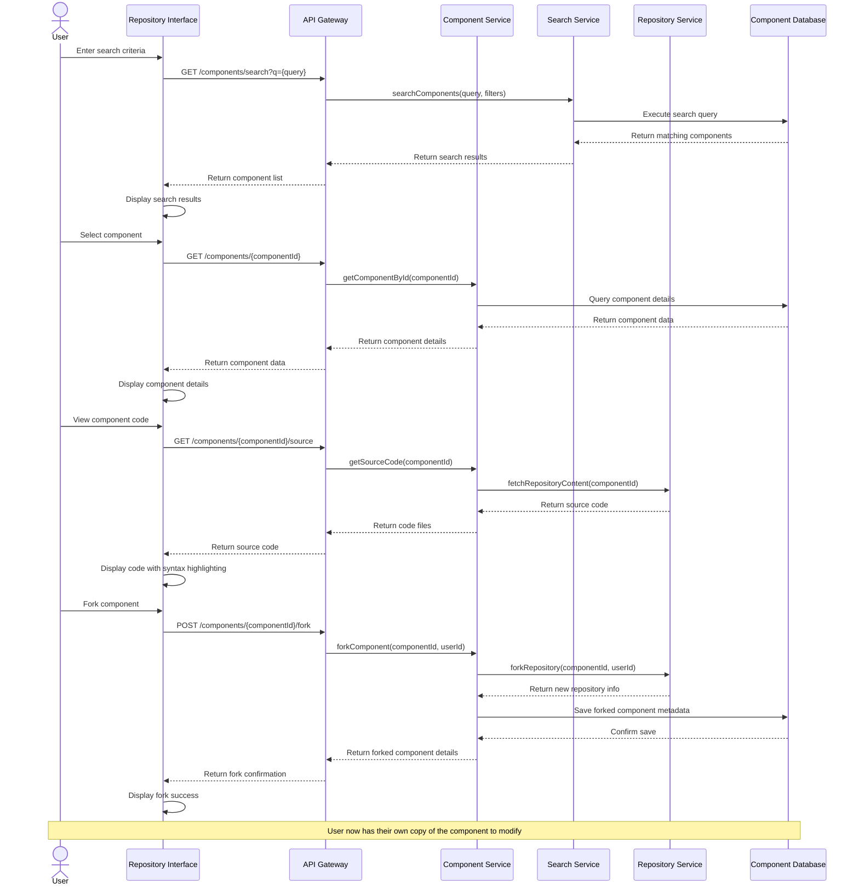
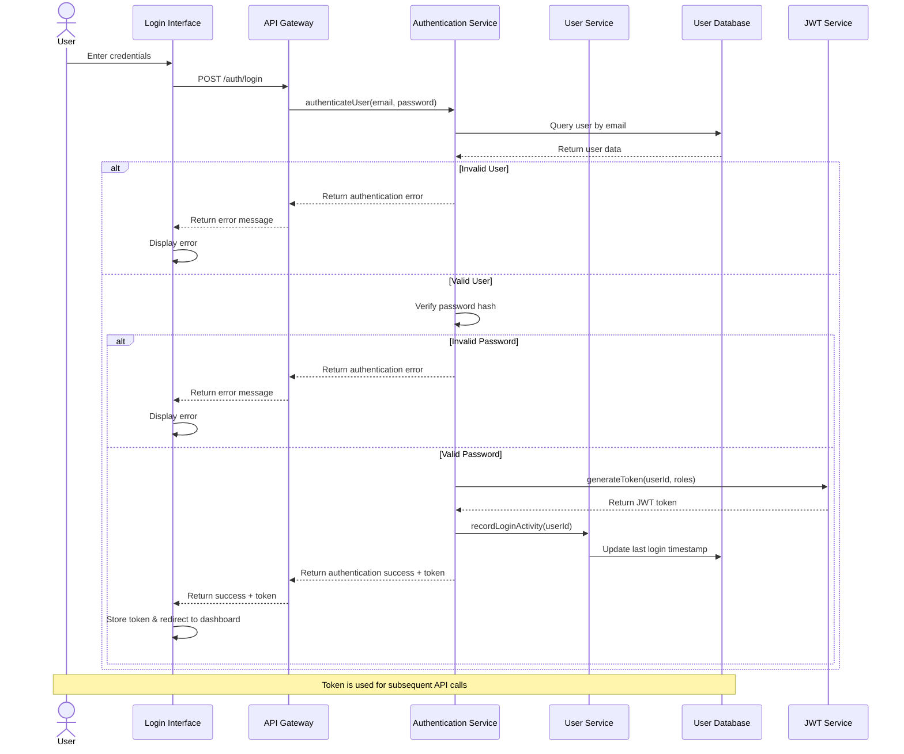
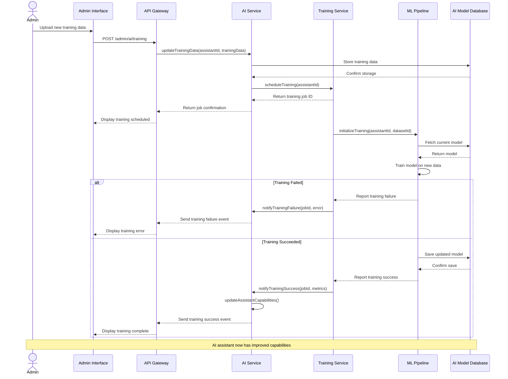
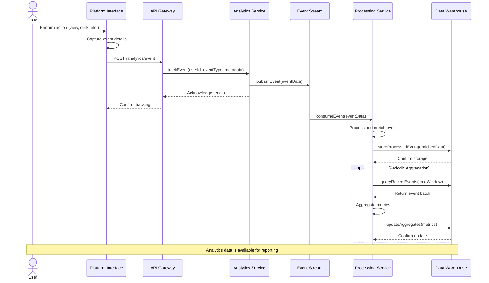
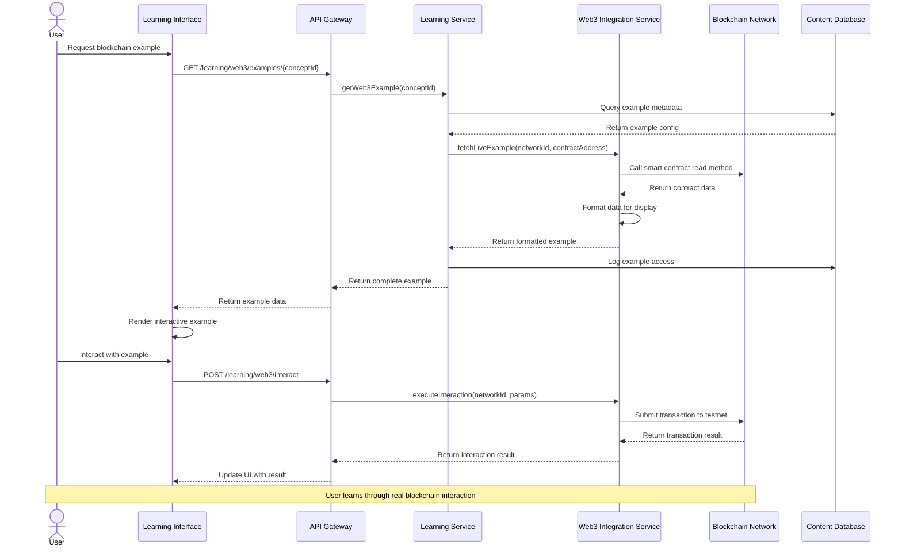
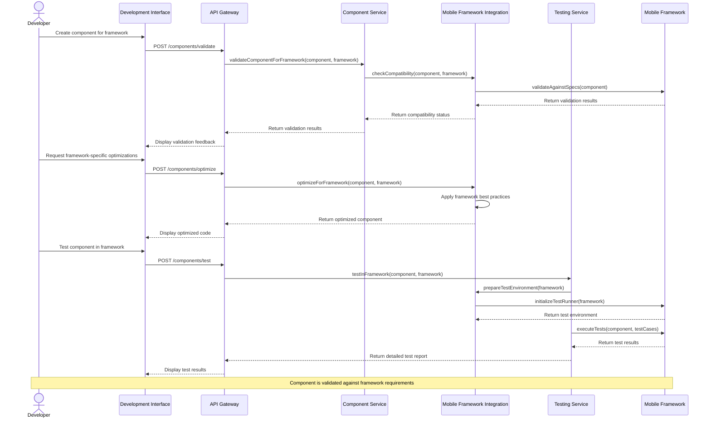
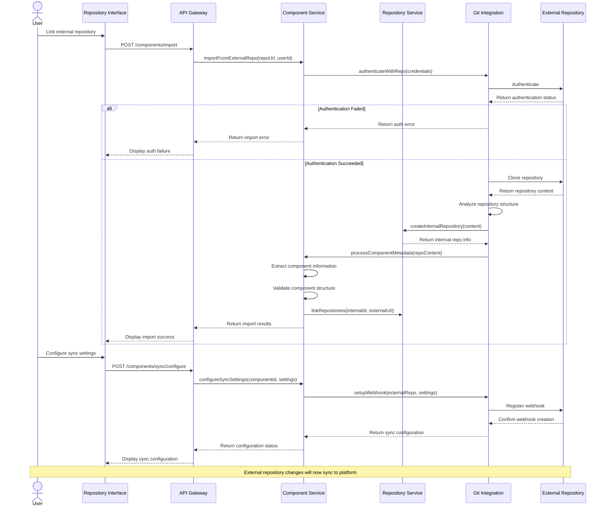

# Brotea: Sequence Diagrams

This document provides detailed sequence diagrams for key interactions within the Brotea platform, illustrating how different components communicate to fulfill core business flows, technical processes, and integration scenarios.

## Core Business Flows

### 1. User Learning Flow

This sequence diagram illustrates how a user interacts with the platform to access and complete educational content on Web3 technologies.

### 2. Component Creation Flow

This sequence diagram shows how a developer creates a new mobile component with AI assistance.

### 3. Component Search and Reuse Flow

This sequence diagram illustrates how a user searches for and reuses an existing component.

## Technical Flows

### 1. User Authentication Flow

This sequence diagram shows the authentication process when a user logs into the platform.

### 2. AI Assistant Training Update Flow

This sequence diagram illustrates the process of updating an AI assistant with new training data.

### 3. Analytics Data Collection Flow

This sequence diagram shows how user activity is tracked and processed for analytics.

## Integration Flows

### 1. Web3 Platform Integration Flow

This sequence diagram illustrates how the platform integrates with external Web3 networks for educational content.

### 2. Mobile Framework Integration Flow

This sequence diagram shows how the platform integrates with mobile development frameworks.

### 3. External Repository Integration Flow

This sequence diagram illustrates how the platform integrates with external code repositories.

## Supporting Documentation

### Critical Path Analysis

The following paths represent the most critical sequences that require optimization for performance and reliability:

1. **User Authentication Flow**
   - Critical for all user interactions
   - Must be secure and responsive
   - Failure impacts all platform functionality

2. **AI Assistant Interaction**
   - Core differentiator for the platform
   - Response time directly impacts user experience
   - High computational resource requirements

3. **Component Search and Retrieval**
   - Frequently used functionality
   - Must scale with repository growth
   - Search performance impacts developer productivity

### Performance Considerations

1. **AI Response Time Optimization**
   - Implement model caching for common queries
   - Consider edge deployment for lower latency
   - Use progressive response for complex queries

2. **Repository Scaling**
   - Implement efficient indexing for component metadata
   - Use CDN for component asset delivery
   - Consider sharding for large repository growth

3. **Learning Content Delivery**
   - Cache frequently accessed educational content
   - Optimize media delivery for various network conditions
   - Implement progressive loading for large modules

### Security Checkpoints

1. **Authentication and Authorization**
   - JWT validation on all protected endpoints
   - Role-based access control for administrative functions
   - Rate limiting to prevent abuse

2. **Component Validation**
   - Code scanning for security vulnerabilities
   - Sandboxed execution for component testing
   - Versioned dependencies with security scanning

3. **External Integrations**
   - Secure credential storage for external services
   - API key rotation policies
   - Audit logging for all external interactions

### Monitoring Points

1. **User Experience Metrics**
   - AI response time tracking
   - Page load performance
   - Error rates by feature

2. **System Health**
   - Service availability monitoring
   - Database performance metrics
   - API endpoint response times

3. **Business Metrics**
   - User engagement tracking
   - Component usage statistics
   - Learning progress analytics

## Implementation Notes

### Technical Dependencies

1. **AI Assistant Implementation**
   - Requires NLP model deployment infrastructure
   - Depends on training data pipeline
   - Needs feedback loop mechanism

2. **Web3 Integration**
   - Requires connections to multiple blockchain networks
   - Depends on wallet integration capabilities
   - Needs testnet environment for examples

3. **Mobile Framework Support**
   - Requires test environments for multiple frameworks
   - Depends on framework-specific validation rules
   - Needs component transpilation capabilities

### Constraints and Limitations

1. **AI Response Time**
   - Complex queries may exceed target response times
   - Model size vs. performance tradeoffs
   - Training data quality impacts response accuracy

2. **External Integration Reliability**
   - Blockchain network availability varies
   - External repository API rate limits
   - Mobile framework version compatibility

3. **Scalability Considerations**
   - Component repository growth may impact search performance
   - Concurrent AI requests may require queue management
   - User analytics data volume requires efficient storage strategy

### Testing Requirements

1. **Integration Testing**
   - Mock external services for reliable testing
   - Test all error paths and recovery mechanisms
   - Verify sequence timing under various loads

2. **Performance Testing**
   - Benchmark AI response times under load
   - Test repository search with large dataset
   - Measure content delivery performance

3. **Security Testing**
   - Penetration testing for authentication flows
   - Vulnerability scanning for uploaded components
   - Data privacy compliance verification
