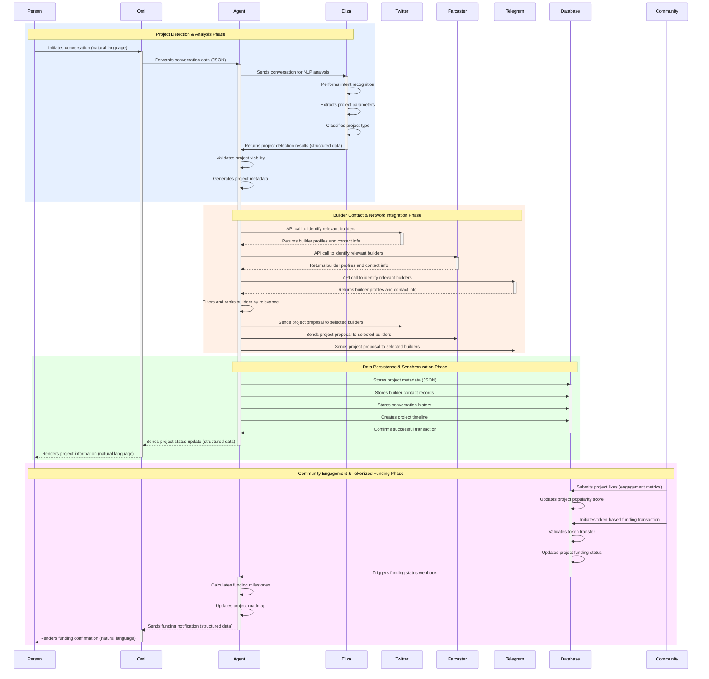

# Brotea Platform - Technical Flow (Advanced Version)



# Builder Process - Technical Flow (Advanced Version)

```mermaid
sequenceDiagram
    participant Builder as Builder #LightBlue
    participant Agent as Agent #Gold
    participant ExecutionPlan as Execution Plan #LightGreen
    participant GrantApplications as Grant Applications #Pink
    participant MarketingCampaigns as Marketing Campaigns #Purple
    participant GrantFounder as Grant Founder #Orange
    participant Database as Database #LightGray
    participant Analytics as Analytics Engine #Red
    
    %% Phase 1: Plan Initiation & Project Architecture
    rect rgb(230, 240, 255)
    Note over Builder,Builder: Plan Initiation & Project Architecture Phase
    Builder->>Agent: Submits execution request (authenticated API call)
    activate Agent
    Agent->>Agent: Validates builder credentials
    Agent->>Agent: Retrieves project metadata
    Agent->>ExecutionPlan: Initiates plan generation algorithm
    activate ExecutionPlan
    ExecutionPlan->>ExecutionPlan: Analyzes project requirements
    ExecutionPlan->>ExecutionPlan: Generates task dependency graph
    ExecutionPlan->>ExecutionPlan: Calculates resource requirements
    ExecutionPlan->>ExecutionPlan: Optimizes execution timeline
    ExecutionPlan-->>Agent: Returns comprehensive execution plan (JSON)
    deactivate ExecutionPlan
    Agent->>Analytics: Logs plan generation event
    Agent-->>Builder: Renders interactive execution plan
    Builder->>Agent: Submits plan approval (digital signature)
    end
    
    %% Phase 2: Grant Applications & Funding Strategy
    rect rgb(255, 230, 240)
    Note over Agent,Agent: Grant Applications & Funding Strategy Phase
    Agent->>GrantApplications: Initiates application workflow
    activate GrantApplications
    GrantApplications->>GrantApplications: Matches project to grant opportunities
    GrantApplications->>GrantApplications: Generates application documents
    GrantApplications->>GrantApplications: Submits applications to grant platforms
    GrantApplications->>GrantApplications: Tracks application status
    GrantApplications-->>Agent: Returns application status matrix
    deactivate GrantApplications
    Agent->>Analytics: Logs application metrics
    end
    
    %% Phase 3: Marketing Campaign Orchestration
    rect rgb(240, 230, 255)
    Note over Agent,Agent: Marketing Campaign Orchestration Phase
    Agent->>MarketingCampaigns: Initiates marketing strategy generation
    activate MarketingCampaigns
    MarketingCampaigns->>MarketingCampaigns: Analyzes target audience
    MarketingCampaigns->>MarketingCampaigns: Creates content calendar
    MarketingCampaigns->>MarketingCampaigns: Deploys cross-platform campaigns
    MarketingCampaigns->>MarketingCampaigns: Monitors engagement metrics
    MarketingCampaigns->>MarketingCampaigns: Optimizes campaign parameters
    MarketingCampaigns-->>Agent: Returns performance analytics dashboard
    deactivate MarketingCampaigns
    Agent->>Analytics: Logs marketing performance data
    end
    
    %% Phase 4: Grant Founder Matching & Negotiation
    rect rgb(255, 240, 230)
    Note over Agent,Builder: Grant Founder Matching & Negotiation Phase
    Agent->>GrantFounder: Initiates founder matching algorithm
    activate GrantFounder
    GrantFounder->>GrantFounder: Analyzes project-founder compatibility
    GrantFounder->>GrantFounder: Ranks potential founders
    GrantFounder->>GrantFounder: Generates introduction materials
    GrantFounder-->>Agent: Returns founder recommendations with match scores
    deactivate GrantFounder
    Agent-->>Builder: Presents founder matches with compatibility metrics
    Builder->>GrantFounder: Initiates secure communication channel
    activate GrantFounder
    Builder->>GrantFounder: Conducts negotiation process
    deactivate GrantFounder
    end
    
    %% Phase 5: Project Status Synchronization & Reporting
    rect rgb(230, 255, 230)
    Note over Builder,Builder: Project Status Synchronization & Reporting Phase
    Builder->>Database: Submits encrypted status update
    activate Database
    Database->>Database: Validates update signature
    Database->>Database: Applies transactional updates
    Database->>Database: Triggers status webhooks
    Database-->>Agent: Notifies of status change
    deactivate Database
    Agent->>Analytics: Requests comprehensive analytics
    activate Analytics
    Analytics->>Analytics: Aggregates project metrics
    Analytics->>Analytics: Generates performance visualizations
    Analytics->>Analytics: Compiles recommendation engine output
    Analytics-->>Agent: Returns analytical report package
    deactivate Analytics
    Agent-->>Builder: Delivers interactive project dashboard
    deactivate Agent
    end
