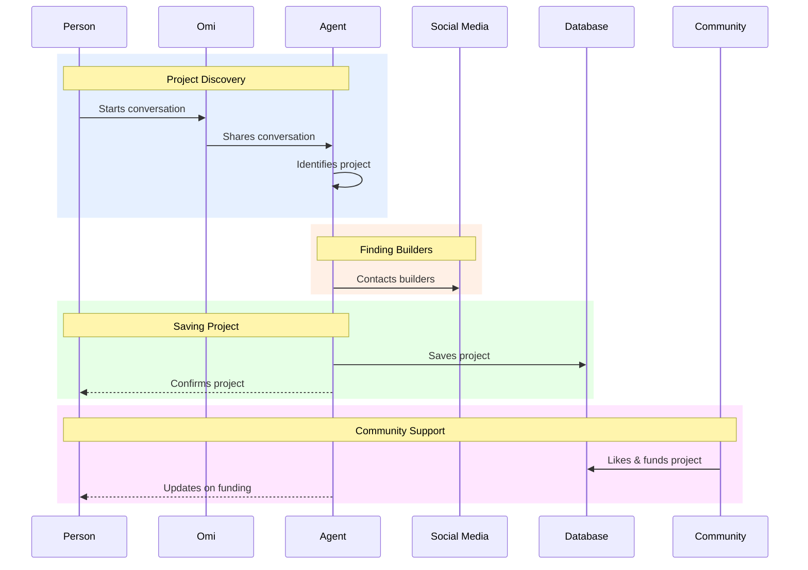

# Action Item Platform - Basic Flow (Easy Version)



# Builder Process - Basic Flow (Easy Version)

```mermaid
sequenceDiagram
    participant Builder as Builder #LightBlue
    participant Agent as Agent #Gold
    participant Plan as Project Plan #LightGreen
    participant Funding as Funding #Pink
    participant Marketing as Marketing #Purple
    
    %% Phase 1: Planning
    rect rgb(230, 240, 255)
    Note over Builder,Plan: Planning Phase
    Builder->>Agent: Starts project
    Agent->>Plan: Creates plan
    Agent-->>Builder: Shows plan
    end
    
    %% Phase 2: Execution
    rect rgb(255, 230, 240)
    Note over Agent,Marketing: Execution Phase
    Agent->>Funding: Applies for funding
    Agent->>Marketing: Starts marketing
    end
    
    %% Phase 3: Completion
    rect rgb(230, 255, 230)
    Note over Builder,Agent: Completion Phase
    Agent-->>Builder: Connects with funders
    Agent-->>Builder: Provides final report
    end
