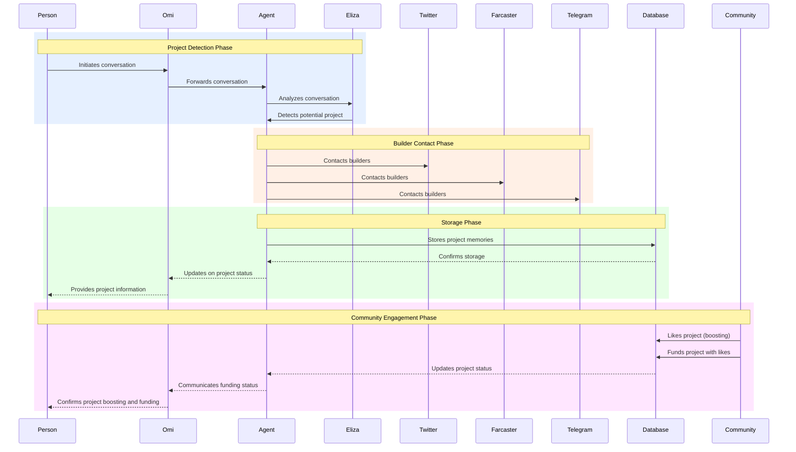

# Brotea Platform - Standard Flow (Medium Version)



# Builder Process - Standard Flow (Medium Version)

```mermaid
sequenceDiagram
    participant Builder as Builder #LightBlue
    participant Agent as Agent #Gold
    participant ExecutionPlan as Execution Plan #LightGreen
    participant GrantApplications as Grant Applications #Pink
    participant MarketingCampaigns as Marketing Campaigns #Purple
    participant GrantFounder as Grant Founder #Orange
    participant Database as Database #LightGray
    
    %% Phase 1: Plan Initiation
    rect rgb(230, 240, 255)
    Note over Builder,Builder: Plan Initiation Phase
    Builder->>Agent: Requests to execute project
    Agent->>ExecutionPlan: Initiates execution plan
    ExecutionPlan-->>Agent: Provides execution steps
    Agent-->>Builder: Presents execution plan
    Builder->>Agent: Approves execution plan
    end
    
    %% Phase 2: Grant Applications
    rect rgb(255, 230, 240)
    Note over Agent,Agent: Grant Applications Phase
    Agent->>GrantApplications: Prepares applications
    GrantApplications-->>Agent: Application status updates
    end
    
    %% Phase 3: Marketing
    rect rgb(240, 230, 255)
    Note over Agent,Agent: Marketing Phase
    Agent->>MarketingCampaigns: Launches marketing
    MarketingCampaigns-->>Agent: Campaign metrics
    end
    
    %% Phase 4: Grant Founder Connection
    rect rgb(255, 240, 230)
    Note over Agent,Builder: Grant Founder Connection Phase
    Agent->>GrantFounder: Identifies grant founders
    GrantFounder-->>Agent: Founder availability
    Agent-->>Builder: Connects with grant founder
    end
    
    %% Phase 5: Project Update
    rect rgb(230, 255, 230)
    Note over Builder,Builder: Project Update Phase
    Builder->>Database: Updates project status
    Database-->>Agent: Confirms status update
    Agent-->>Builder: Provides project report
    end
